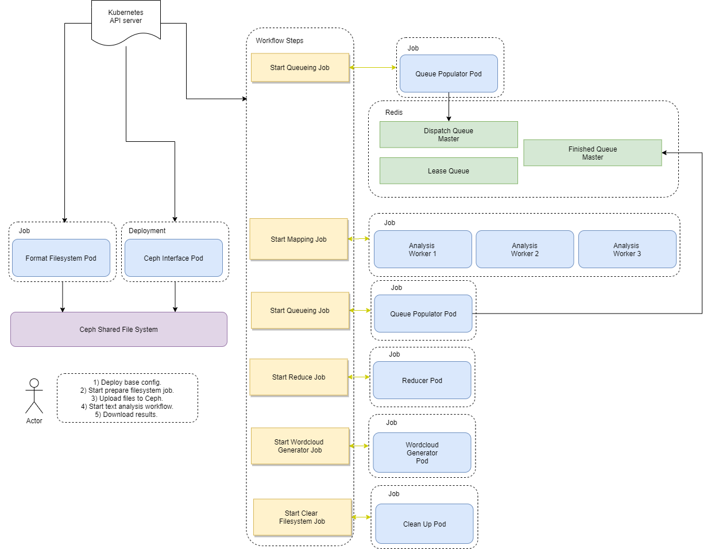

# k8s-wordcount
## Getting Started


## Prerequisites
Ensure that the following are installed and running:
- Rook/Ceph
- Argo

## Running the Application
### 1. Apply base config
`kubectl apply -f ./config/base-config.yml`
### 2. Execute prepare filesystem job
`kubectl apply -f ./config/prepare-filesystem-job.yml`
### 3. Upload files
`kubectl -n k8s-text-analysis cp <local dir/> <some-pod>:/mnt/ceph-filesystem`
### 4. Start text analysis job
`kubectl apply -f ./config/wordcount-workflow.yml`
### 5. Download results
`kubectl cp k8s-text-analysis/<some-pod>:/mnt/ceph-filesystem/wordcloud_image .`

## Debugging
Check on redis
```
kubectl -n k8s-text-analysis exec -it <redis pod> -- /bin/bash
redis-cli -h redis
lrange <queue-name> 0 -1
```
Access ceph interface, for debugging purposes
```
kubectl -n k8s-text-analysis exec -it <some-pod> -- /bin/bash
```


